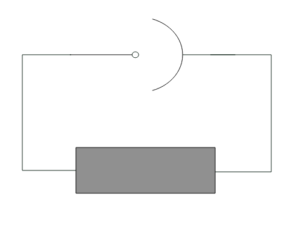
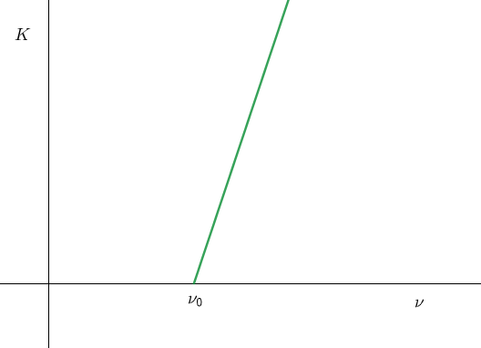

# 光電効果
## 予備知識
- 光の明るさは光子の個数と比例関係にある
- **光電子**：光電効果で飛び出してきた電子
- **仕事関数**：金属の引力を振りきって光電子が飛び出すのに必要な最低限のエネルギー
- **阻止電圧**：問題のような光電効果の実験において、光電子を妨げるためにかけられる電圧の最小値

## 問題
以下のような装置Xを用いて光電効果の実験を行う。

装置Xは下の図のように回路に埋め込んで用いる。

装置Xに左から周波数 $\lambda$ の光を照射すると、金属板から光電子が飛び出し、回路に電流が流れる。

> (1) これにより、電流はAからB、BからAのどちら向きに流れるか。

灰色の部分では、A-B間の電圧を調節することができ、また装置Xに流れる電流を計測できる。

以下では電流の向きを、(1)で答えた向きを正とする。
またBを電位の基準とする。

光の明るさを一定に保ち、A-B間の電圧 $V$ を調節しながら装置に流れる電流 $i$ を計測したところ以下のようなグラフが得られた。

電子の電荷を $q$ とする。

> (2) 仮に明るさを倍にしたときに予想されるグラフをかけ。

> (3) この実験時の阻止電圧はいくらか。

> (4) 光電子の運動エネルギーの最大値 $K$ はいくらか。

$\lambda$ を変えながら $K$ を計測すると以下の様な直線のグラフが得られた。

プランク定数を $h$ とする。

> (5) この直線の傾きはいくらか。

> (6) 装置Xの仕事関数はいくらか。